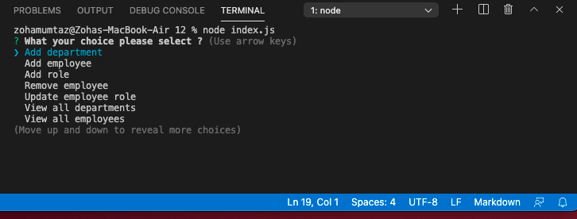

# Employee Tracker
In this application the command line is managing the company employee records via node,inquirer, and MySQL.

## User stroy
AS A business owner
I WANT to be able to view and manage the departments, roles, and employees in my company
SO THAT I can organize and plan my business

## Getting Started
Download the code install the technologies required for this project 
Follow the Installition part of Readme.md file to install the required softwares
a. in order to create the table please open the Mysql work bench and run cms.sql and create data table
b.then run seed.sql to make the database with data
after completion of your data  open index.js and enter your password on the required line.
Open your terminal and type nod.ndex.js

# Testing
1. Click ''view all employees''

2. Click ''view all employees by department ''

3. Click ''view all roles''

 
5. Start adding "Add department " then click "view all departments" inorder to confirm that 

6. The new department is added.

7. Now click "Add employee" next click " view all roles" 

8. Click " remove employee" next click " view all employees

9. Now click " update employee role" now click " view all employees"

## Technologies used 
visual studio code
Terminal
node
inquirer
mysql
console.table
## GIF

## Video of the Assignment 
https://youtu.be/sFNFVpG6_xA

## Deployed link
https://github.com/zohamumtaz/employee-tracker

## Screenshots

## Author 
Zoha Mumtaz

## License
Licensed under the MIT license
